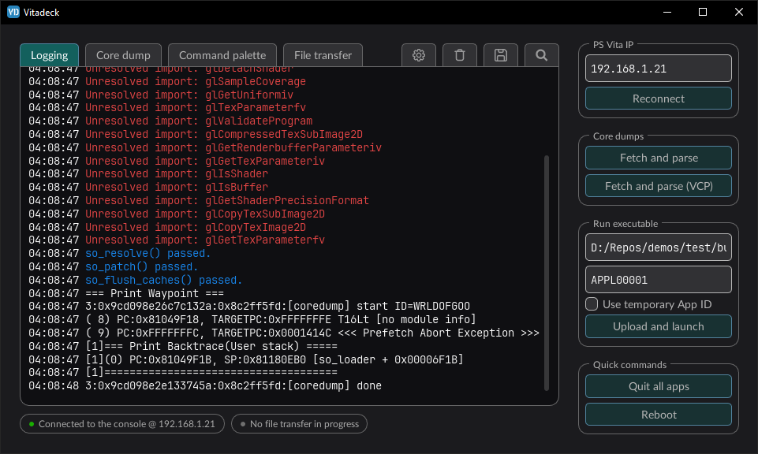
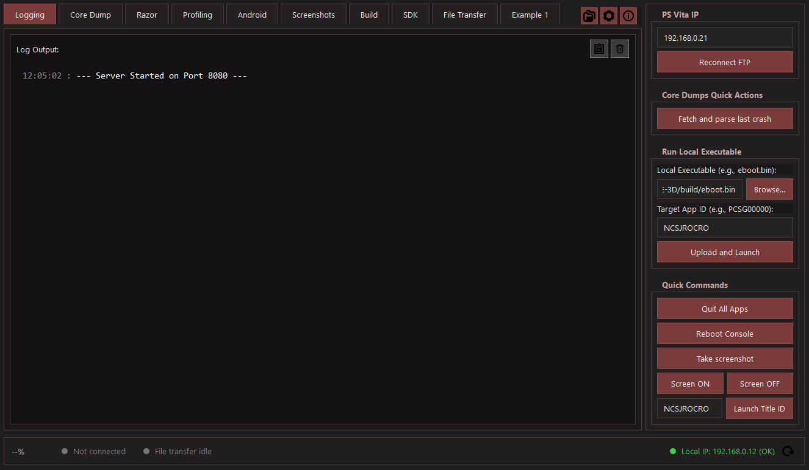
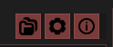
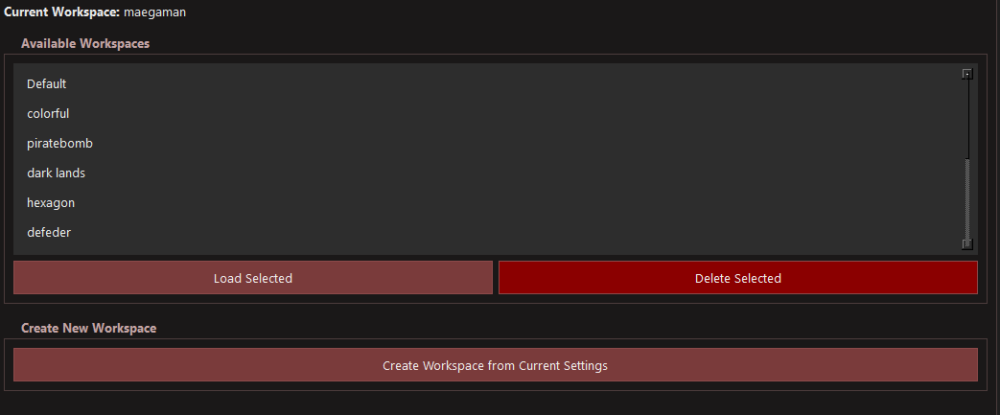
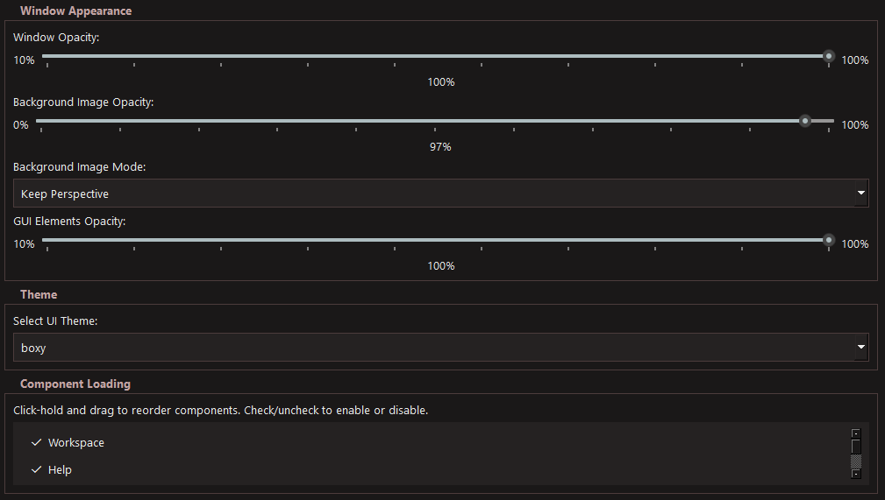
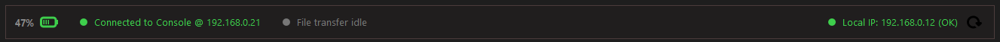
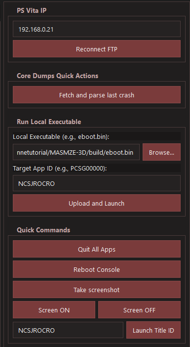

# Vita Ultra Parse / VitaDeck

A development utility suite for the **PS Vita**, built to help with logging, crash parsing, screenshots, FTP transfer, project builds, and common console commands.

The project was inspired by an idea shared on the Vita Nuova Discord by developer **gl33ntwine**, you can find his github [here](https://github.com/v-atamanenko).



---

## Table of Contents

1. [Project Overview](#1-project-overview)
2. [Important Notice](#2-important-notice)
3. [VitaDeck Interface](#3-vitadeck-interface)
4. [Features](#4-features)
   1. [Configuration System](#41-configuration-system)
   2. [Bottom Status Bar](#42-bottom-status-bar)
   3. [Quick Commands](#43-quick-commands)
5. [Components](#5-components)
   1. [Working Components](#51-working-components)
   2. [In Progress](#52-in-progress)
   3. [Planned Features](#53-planned-features)
6. [Custom Components](#6-custom-components)
   1. [Where to Place Custom Components](#61-where-to-place-custom-components)
   2. [Minimal Component Examples](#62-minimal-component-examples)
   3. [Supported Optional Arguments](#63-supported-optional-arguments)
7. [Setup Guide](#7-setup-guide)
   1. [Requirements](#71-requirements)
   2. [Prepare Your PS Vita](#72-prepare-your-ps-vita)
   3. [Prepare Your PC Workspace](#73-prepare-your-pc-workspace)
   4. [Initial Application Setup](#74-initial-application-setup)
   5. [Generate an ELF File for Crash Parsing](#75-generate-an-elf-file-for-crash-parsing)
8. [Platform Notes](#8-platform-notes)
9. [Credits](#9-Credits)

---

## 1. Project Overview

**Vita Ultra Parse** is a Python-based development toolkit for PS Vita development workflows.

The main application, **VitaDeck**, provides a desktop interface for common development tasks such as:

- Reading PS Vita logs on your PC
- Capturing screenshots from the console
- Sending files over FTP
- Managing workspaces and build directories
- Running quick console commands
- Retrieving crash dumps
- Performing core dump and crash analysis

---

## 2. Important Notice

> [!WARNING]
> This application is still evolving.
>
> It was developed in Python and may contain unexpected bugs or edge cases.
>
> You are encouraged to modify it, extend it, and add your own modules.
>
> AI tools were used to help reorganize parts of the codebase after the application became functional.

---

## 3. VitaDeck Interface



VitaDeck is the main graphical interface for the toolkit. It organizes the project into workspaces, settings, commands, and loadable components.

---

## 4. Features

### 4.1 Configuration System

The configuration system currently supports:

- Workspace management
- Basic help and information
- SDK configuration
- Server listening port configuration
- Theme support
- Custom theme support
- Component enable/disable controls from the **Components** tab



#### Workspace Management

Workspaces allow you to create, delete, and load the projects you are working on.



#### Settings Panel

The settings panel includes configuration options for the SDK, server ports, themes, and component loading.



---

### 4.2 Bottom Status Bar

The bottom status bar displays useful runtime information:

- PS Vita battery status
- Connection status
- File transfer activity
- Local PC IP address

The local PC IP address is useful for confirming that your PC and PS Vita are connected to the same network.



---

### 4.3 Quick Commands

The quick command panel provides shortcuts for common PS Vita actions:

- Connect to the console through FTP
- Retrieve the latest crash dump
- Perform core dump analysis
- Send a compiled executable, such as `eboot.bin`, to the console
- Execute sent applications
- Open a custom application
- Quit all running applications
- Reboot the console
- Capture screenshots
- Turn the screen on or off
- Launch an application using a specific Title ID

Screenshots are saved in the following folder:

```text
screenshots/
```



---

## 5. Components

### 5.1 Working Components

The following components are currently working:

- PS Vita logging to PC
- Core dump and crash analysis
- Screenshot capture
- Project build support
- Build directory management
- FTP file transfer

---

### 5.2 In Progress

The following features are currently being developed:

- Basic SDK configuration tools

---

### 5.3 Planned Features

Future planned features include:

- Razor capture management
- Profiling tools
- Performance analysis
- Android analysis
  
---

## 6. Custom Components

VitaDeck supports custom modules/components.

A basic example is available at:

```text
vita-ultra-parse/components/custom/example1.py
```

You can edit this file or create a new one to add your own functionality.

---

### 6.1 Where to Place Custom Components

Recommended location:

```text
components/custom/*.py
```

Alternative location:

```text
components/*.py
```

When placing custom components in the top-level `components/` folder, avoid using names that conflict with built-in modules.

On application startup, each discovered component file is automatically added as a loadable component under:

```text
Settings > Component Loading
```

---

### 6.2 Minimal Component Examples

#### Factory Style

```python
from PySide6.QtWidgets import QLabel

COMPONENT_LABEL = "Example 1"

def create_component():
    return QLabel("Hello from custom component")
```

#### Class Style

```python
from PySide6.QtWidgets import QWidget, QVBoxLayout, QLabel

COMPONENT_KEY = "example1"
COMPONENT_LABEL = "Example 1"

class ComponentTab(QWidget):
    def __init__(self, parent=None):
        super().__init__(parent)

        layout = QVBoxLayout(self)
        layout.addWidget(QLabel("Hello from custom component"))
```

---

### 6.3 Supported Optional Arguments

Custom components may optionally receive the following arguments by name:

- `settings`
- `cmd_thread`
- `parent`
- `project_root`
- `screenshots_dir`

---

## 7. Setup Guide

### 7.1 Requirements

Before starting, make sure you have:

- Python 3.x installed
- A PS Vita with:
  - VitaShell
  - `catlog`
  - The modified `vitacompanion-vitadeck` plugin
- Your PC and PS Vita connected to the same network

---

### 7.2 Prepare Your PS Vita

#### 7.2.1 Install CatLog

Install and configure `catlog` so the PS Vita can send logs to the server. Repository can be found [here](https://github.com/isage/catlog).

Make sure both the PS Vita and the server use the same IP address and port configuration.

---

#### 7.2.2 Install VitaCompanion-VitaDeck

VitaDeck requires the modified VitaCompanion plugin fork with screenshot and battery command support.
Repository can be found [here](https://github.com/Rocroverss/vitacompanion-vitadeck).
Just install thew release [vitacompanion.suprx](https://github.com/Rocroverss/vitacompanion-vitadeck/releases)

#### Installation Steps

1. Launch **VitaShell** on your PS Vita.
2. Press `SELECT` to start the FTP server.
3. Copy `vitacompanion.suprx` to:

   ```text
   ur0:/tai/
   ```

4. Edit the following file:

   ```text
   ur0:/tai/config.txt
   ```

5. Add these lines:

   ```text
   *main
   ur0:tai/vitacompanion.suprx
   ```

6. Reboot your PS Vita.

After rebooting, your PS Vita should be ready to use with VitaDeck.

---

### 7.3 Prepare Your PC Workspace

#### 7.3.1 Install Dependencies

Install the required Python packages:

```bash
pip install -r requirements.txt
```

---

#### 7.3.2 Run the Application

Start VitaDeck with:

```bash
python main.py
```

---

### 7.4 Initial Application Setup

After launching VitaDeck:

1. Open the **Workspaces** tab.
2. Create a new workspace.
3. Configure the modules you want to use.
4. Open **Settings**.
5. Configure the SDK path.
6. Optional: load the ELF file in the **Core Dump** section to enable crash parsing support.
7. Optional: configure the local executable path for the **Quick Settings** menu.

---

### 7.5 Generate an ELF File for Crash Parsing

If your project build is not generating an ELF file, add a post-build command to your `CMakeLists.txt`.

Replace the target name, file name, and output paths with values that match your project.

```cmake
# Post-build: copy raw ELF for parsing
add_custom_command(
    TARGET kkr
    POST_BUILD
    COMMAND ${CMAKE_COMMAND} -E copy $<TARGET_FILE:kkr> ${CMAKE_BINARY_DIR}/kkr.elf
    COMMAND ${CMAKE_COMMAND} -E copy $<TARGET_FILE:kkr> /home/mint/Desktop/vita-parse-core/kkr.elf
    COMMENT "Copying raw ELF for parsing output"
)
```

#### What You Should Change

Replace the following values:

- `kkr`  
  Your CMake target name.

- `kkr.elf`  
  The desired ELF output filename.

- `/home/mint/Desktop/vita-parse-core/kkr.elf`  
  The output path you want to use on your system.

---

## 8. Platform Notes

> [!WARNING]
> VitaDeck has primarily been tested on Linux.
>
> Windows support may work, but it has not been fully tested yet.

---

## 9. Credits

- Me myself, Rocroverss :)
- [gl33ntwine](https://github.com/v-atamanenko) for the original idea.
- [Paddel06](https://github.com/Paddel06) and [Rinnegatamante](https://github.com/Rinnegatamante)  for the renommendation of commads.
- [isage](https://github.com/isage/catlog) for the catlog plugin.
- [withLogic](https://github.com/withLogic) for additional testing.

